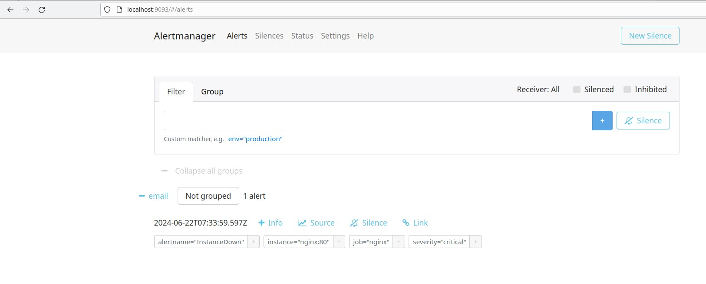
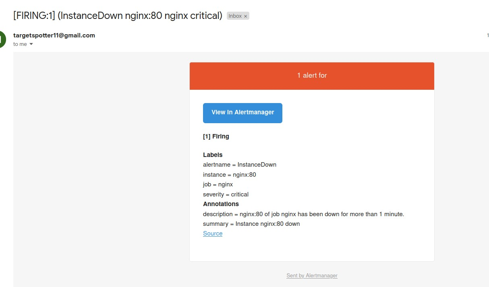
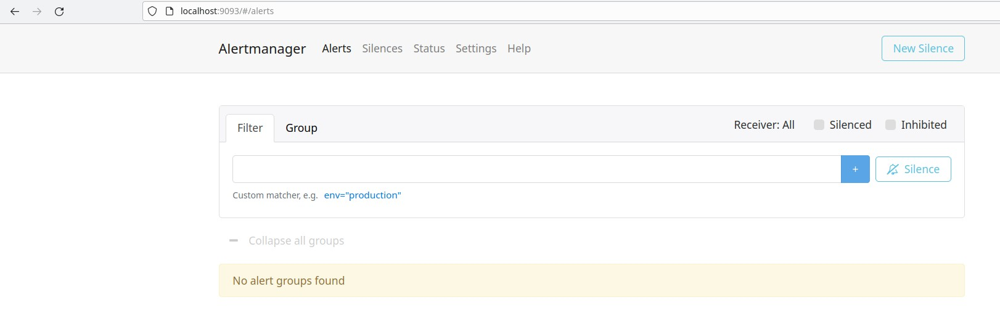
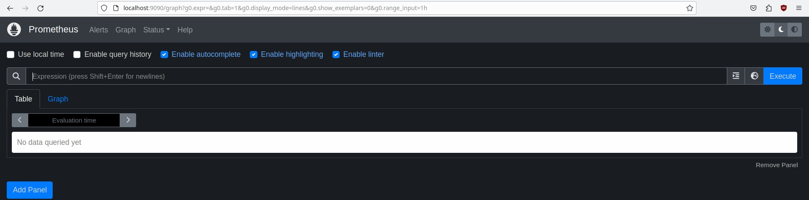
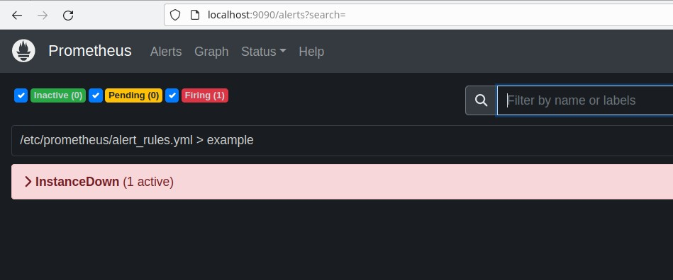

# Monitoring using Prometheus

Welcome to the Monitoring Project repository! This project demonstrates setting up a basic monitoring infrastructure using Docker containers for Prometheus, Alertmanager, and Nginx.

## Overview

This repository contains Docker configurations (`Dockerfile`) and configuration files (`prometheus.yml`, `alertmanager.yml`) to set up the following components:

- **Prometheus**: A monitoring and alerting toolkit.
- **Alertmanager**: Handles alerts sent by Prometheus.
- **Nginx**: Serves as a target for monitoring.

